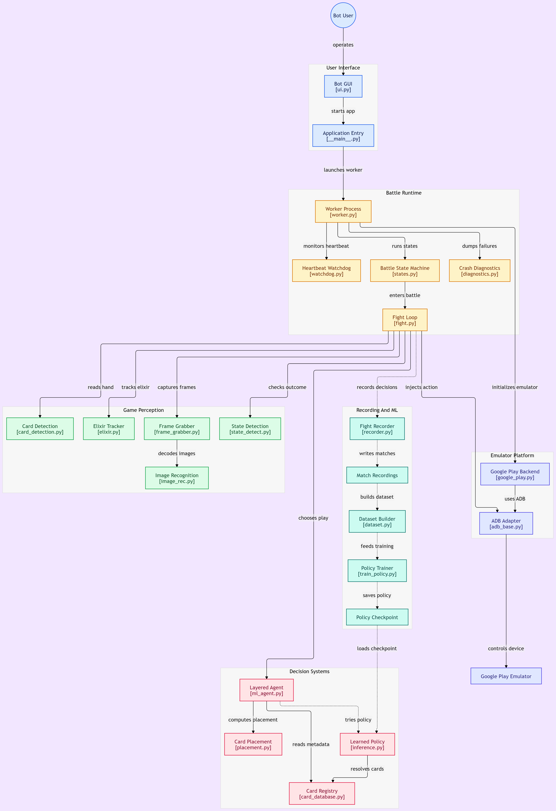

# Clash Royale Bot

An automated Clash Royale battle bot driving the Google Play Games PC (Developer Mode) emulator at 419×633. Reads the elixir bar and hand from screenshots, plays cards through a layered decision engine (learned policy → tactical AI → heuristic → legacy rotation), and records matches as training data.

> ⚠️ **Terms of Service**: Automating Clash Royale violates Supercell's Terms of Service and can result in a permanent account ban. This project is for personal engineering study only. Reliability improvements do not make the bot safe or undetectable.

---

## Features

- **Google Play Games PC** (Developer Mode) as the sole emulator backend, driven through ADB.
- **Heartbeat watchdog** — long-running states (a full battle is 180s+) pulse progress; only genuine silence triggers recovery, not duration.
- **Cooperative stop** — a timeout requests a stop flag that the state thread honors at its next checkpoint, since Python threads cannot be killed.
- **Multiprocess worker** — the bot runs in a separate process from the GUI so the parent can force-terminate it.
- **Pip-divided elixir bar reader** — per-pip majority with contiguous-from-left counting, robust to the sprite's 2px pip dividers and glitched single frames.
- **Fused elixir tracker** — game-clock accrual at official rates, corrected by the bar scanner; scanner lows need 3 confirmations before they're trusted.
- **Layered play decision**: learned policy (if a checkpoint is installed) → tactical AI → heuristic scorer → deterministic rotation, each gated by a confirmed-deployment check.
- **Opt-in fight recording** for building a training dataset.
- **Crash diagnostics** — debug screenshots and crash dumps on failure paths.

---

## Requirements

- Windows 10/11
- Python 3.11+
- [Google Play Games PC](https://play.google.com/googleplaygames) with Developer Mode enabled and Clash Royale installed
- ADB on `PATH`
- Administrator privileges (needed for window focus and input injection)

Python dependencies are listed in `requirements.txt`. Core packages: `opencv-python`, `numpy`, `torch`, `pygetwindow`, `keyboard`, `pyyaml`.

---

## Installation

```powershell
git clone https://github.com/imjimit07/Clash-Royale-Bot.git
cd Clash-Royale-Bot
python -m venv .venv
.venv\Scripts\Activate.ps1
pip install -r requirements.txt
```

Verify ADB sees the emulator before first run:

```powershell
adb devices
```

You should see a device at `127.0.0.1:<port>`. If not, launch Google Play Games, open Clash Royale manually, and re-run `adb devices` — the port is set by the emulator and picked up by the bot at startup.

---

## Running

```powershell
python -m clbot
```

The GUI shows win/loss counters, a live status feed, and a **Stop Bot** button. The panic hotkey is `Ctrl+Shift+Q`.

Command-line flags:

```powershell
python -m clbot --config config.yaml         # alternate config
python -m clbot --debug                      # verbose logging
python -m clbot --max-battles 10             # stop after N battles
python -m clbot --no-humanize                # disable click jitter/delays
```

---

## Configuration

Settings live in `config.yaml`:

```yaml
emulator:
  name: "Google Play Games"
  rendering_mode: "OpenGL"      # OpenGL | DirectX | Vulkan
  adb_port: 6520
  screenshot_interval: 0.1

bot:
  state_timeout_seconds: 20     # heartbeat SILENCE timeout, not duration
  state_warn_seconds: 60
  max_consecutive_restarts: 5
  restart_backoff_base: 5

detection:
  template_tolerance: 0.88
  fallback_tolerance: 0.78
  multi_scale: true

elixir:
  hsv_low:  [125, 80, 120]
  hsv_high: [165, 255, 255]
  wait_timeout: 20
  poll_interval: 0.3

humanization:
  click_jitter_px: 5
  min_action_delay: 0.08
  max_action_delay: 0.25

debug:
  save_unknown_screens: true
  save_on_crash: true
```

`state_timeout_seconds` is the maximum time **without a heartbeat pulse**. A healthy battle pulses roughly once per second, so a genuine match will never approach 20s. Do not raise it to "fix" long battles — that is what the heartbeat is for.

---

## Architecture

```
clbot/
├── bot/
│   ├── worker.py            WorkerProcess, state loop, watchdog integration
│   ├── states.py            state_tree, StateHistory, StateOrder
│   ├── fight.py             fight loop, wait_for_elixir, play_a_card
│   ├── elixir.py            ElixirScanner, ElixirTracker
│   ├── watchdog.py          heartbeat + cooperative stop (leaf module)
│   ├── coords.py            screen-coordinate constants
│   ├── card_database.py     card metadata registry
│   ├── card_detection.py    hand identification, availability
│   ├── ml_agent.py          BattleMLAgent, TacticalAIEngine, AdvancedCombatAI
│   ├── nav.py               menu navigation
│   ├── recorder.py          fight recording for training
│   ├── state_detect.py      battle/ended/win detection
│   └── ml/
│       ├── dataset.py       split_indices_by_game
│       ├── features.py      FeatureEncoder
│       ├── inference.py     LearnedPolicy runtime
│       ├── policy.py        PolicyNet, save_checkpoint
│       └── state.py         GameState, HandCard, EnemyThreat
├── emulators/               emulator backends (Google Play Games only)
├── interface/               GUI
└── utils/                   logger, admin check, diagnostics, versioning
```



### State machine

```
start → select_battle_mode → randomize_deck → cycle_deck → start_fight
      → 1v1_fight → end_fight → start
```

`1v1_fight` runs for the full battle (180s + overtime). The watchdog measures staleness within it, not duration.

### Decision chain inside `play_a_card`

1. **Learned policy** — if `models/policy.pt` or `policy_gru.pt` is present and passes confidence/legality checks.
2. **Tactical AI** — threat-aware heuristic in `ml_agent.py`.
3. **Heuristic scorer** — deterministic fallback.
4. **Legacy rotation** — last resort, always available.

Every play is followed by `_confirm_deployment`, which checks that the hand slot changed or elixir dropped before mutating internal state.

---

## Training (optional)

The bot can record fights as training data if `recording_flag` is enabled. Each recording produces a JSONL of decisions with `policy_source` field indicating which engine made the play.

> **Data quality matters more than model size.** Recordings made under `random_fight_mode` contain random actions and cannot teach a policy to play well. Verify with:
>
> ```powershell
> Select-String -Path recordings\*.jsonl -Pattern '"policy_source"' | Select-Object -First 20
> ```
>
> If the source is `"random"` or missing, re-record with tactical/heuristic play.

### Pipeline

```powershell
# 1. Build a dataset from recordings
python training/build_dataset.py recordings\ data\dataset\

# 2. Train the feed-forward policy
python training/train_policy.py data\dataset\ models\policy.pt --epochs 30

# 3. Train the GRU sequence policy
python training/train_sequence.py data\dataset\ models\policy_gru.pt --seq-len 8
```

### Known training limitations

- **Best-checkpoint saving is not implemented** in either trainer — the last epoch is saved, which is often the most overfit. Add `best_state` tracking on validation metric before relying on the output.
- **Single-game validation** when the dataset is small produces meaningless numbers. Use leave-one-game-out (`games.json` supports it) so validation spans multiple matches.
- **Random-play recordings are unusable for policy learning.**
- **196 samples is well below the threshold** for a policy with 869 input features to generalize. Target 50+ matches (≥1500 decisions) before treating a checkpoint as deployable.
- The runtime's confidence and legality checks reject most bad decisions, so an undertrained checkpoint degrades to the deterministic engines rather than playing badly — but it does not improve play either.

---

## Testing

```powershell
pytest -q -m "not emulator and not ml_runtime"
```

As of last run: **145 tests passing, 10 deselected** (emulator and ML-runtime integration tests require hardware/checkpoints).

Test coverage:

- `tests/test_watchdog.py` — heartbeat staleness, stop flag lifecycle, prompt exit on stop
- `tests/test_elixir.py` — pip-divided bar reading, anti-glitch contiguity, blank-frame handling
- `tests/test_fight_tactical.py` — tactical AI decisions on synthetic board states
- `tests/test_image_rec.py` — blank-frame detection, template matching fallbacks

---

## Troubleshooting

| Symptom | Likely cause | Fix |
| --- | --- | --- |
| `Emulator process missing` immediately on start | Google Play Games not running | Launch it manually, open Clash Royale, then start the bot |
| `ADB device not found` | ADB server stale, or wrong port | `adb kill-server; adb start-server; adb devices` |
| Black screenshots in `debug_screens/` | Emulator mid-transition, or wrong rendering mode | Try a different `rendering_mode` in `config.yaml` |
| `Waited too long for elixir` at 20s | Elixir bar scanner misreading (pip dividers or HSV drift) | Check a `debug_screens/elixir_wait_*.png` against `hsv_low`/`hsv_high`; recalibrate if needed |
| Watchdog fires on a healthy battle | `state_timeout_seconds` too low, or heartbeat not pulsing | Verify pulses are called in the fight loop; do not raise the timeout to mask a missing pulse |
| Repeated emulator restarts | Underlying crash, not a bot bug | Check `logs/session_*.log` for the state and exception that triggered each restart |
| `libpng error` at shutdown | Recording writer tearing down mid-flush | Cosmetic — the last frame may be lost, pack remains readable |

Logs are written to `logs/bot.log` (rotating, 5MB × 5) and per-session files `logs/session_*.log`.

Debug artifacts are written to `debug_screens/`. This folder grows unbounded across runs; prune it periodically.

---

## License

Licensed under MIT License.